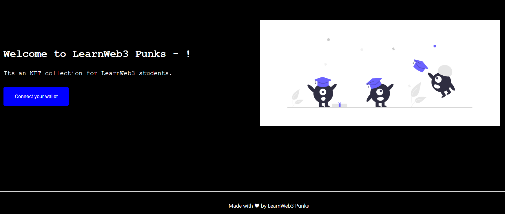
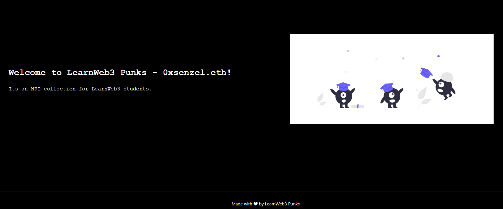

# Introduction to Ethereum Name Service

This repo contains coursework project from [LearnWeb3](https://learnweb3.io/) completed by [0xsenzel](https://github.com/0xSenzel/) for [LearnWeb3DAO-Junior](https://learnweb3.io/courses/6394ea7c-0ad6-4a4a-879f-7f9756bc5976/lessons) lesson.

## Project Info

Connect Ethereum wallet on Goerli network to check your ENS domain name. To acquire an ENS domain name on Goerli, head to [Ethereum Name Service](https://app.ens.domains/) to register a domain name.

## Project Demo

<figure>

<p align="center">Fig.1 - Home Page</p>
</figure>

<br/>

<figure>

<p align="center">Fig.2 - Login An Account with ENS Domain</p>
</figure>

## Project Setup

### React & Next Js

Under [root](./) folder:

```
npm install
```

To run the app locally:

```
npm run dev
```
